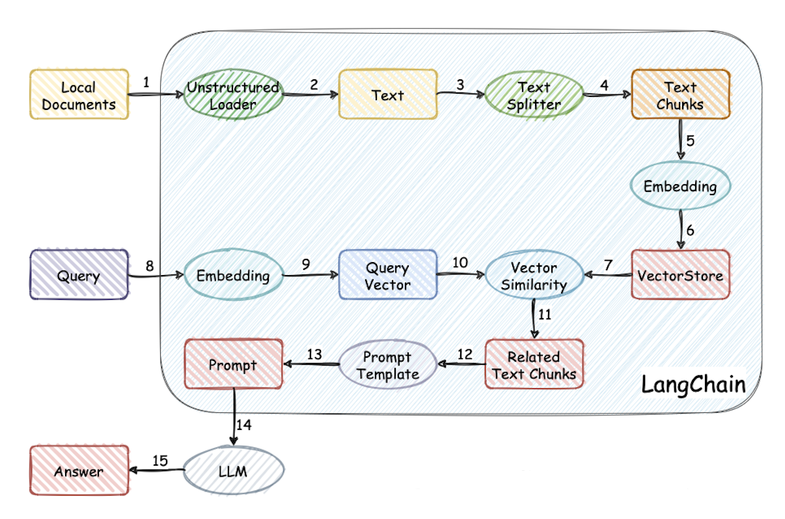

# 基于 LangChain 和 LLMs 的知识库问答系统

组号：......

## 小组成员及分工

......

## 应用背景

继 OpenAI 推出 ChatGPT 大受欢迎后，市面上出现了各种各样的开源和闭源大语言模型（LLM, Large Language Model），如何在各种下游任务上充分利用大语言模型的能力成为了当前的热点问题。

由于大语言模型通常基于通识知识进行训练，因此在面向垂直领域知识、基于私有数据的问答等场景时，常常需要借助模型微调或提示词工程提升语言模型的应用效果。

微调是针对预先训练的语言模型，在特定任务的少量数据集上对其进行进一步训练。当任务或域定义明确，并且有足够的标记数据可供训练时，通常使用微调过程。

提示词工程涉及设计自然语言提示或指令，可以指导语言模型执行特定任务。最适合需要高精度和明确输出的任务。提示工程可用于制作引发所需输出的查询。

## 项目介绍

本项目基于 LangChain 框架，不涉及微调和训练过程。用户可以上传本地 TXT、DOCX、PDF 等格式文档作为本地知识库。然后使用本地的 LLM 模型 ChatGLM2-6B（或者在线调用智谱AI提供的免费 API keys），结合 Embedding 模型 m3e-base 进行向量匹配，实现基于本地知识库的问答系统。

## 项目原理

本项目实现原理基本如下图所示：



首先加载和读取本地知识文件内容获取需要处理的文本数据，然后对整个文本进行切分为后续处理做好准备。

将分割后的各个文本块转化为向量，同时也将用用户提问转化为向量。

进行相似度计算，在文本向量中匹配出与问题向量最相似的前 k 个文本，答案被包含在这前 k 个文本中。

匹配出的文本作为上下文和问题一起添加到 prompt 模板中形成最终的输入。

最后将输入提交给大语言模型，大语言模型整合输入信息生成自然流畅的回答在页面上展示给用户。

整个过程类似于一个生成模型做给定文本的摘要提取，这里生成模型就是 ChatGLM2-6B/百度智谱AI，文本就是从知识库中匹配出的前 k 个文本，提取出的摘要就是回答。


从文档处理角度来看，整个实现流程如下：


## 技术选型

### LLM

#### ChatGLM-6B

ChatGLM-6B 是一个开源的、支持中英双语的对话语言模型，基于 General Language Model（GLM）架构，具有 62 亿参数，具备自我认知、提纲写作、文案写作、信息抽取等能力。

#### ChatGLM-Turbo

智谱 AI 对外免费提供利用该模型生成一定量 token 的服务。在智谱 AI 官网上注册账号即可获得相应 API key 调用该模型。

### LangChain

LangChain 是一个用于开发由语言模型驱动的应用程序框架。通过提供 Modules、Prompt、Memory、Indexes、Chain、Agents 等模块，实现调用语言模型，将不同数据源接入到语言模型的交互中，允许语言模型与运行环境交互的功能。可用于文本问答、信息抽取、文档总结等应用场景。

### Stremlit

Streamlit 是一个基于 Python 的库，用于快速构建和共享机器学习和数据科学 Web 应用程序。专为数据科学家或机器学习工程师设计，使用不需要了解 Web 开发的基础知识。本项目使用 Streamlit 搭建 Web UI 页面。

### FastChat

本项目基于大模型推理框架 FastChat 加载 LLM 服务。FastChat 是一个开放平台，用于训练、服务和评估基于 LLM 的聊天机器人，使用 FastAPI + Uvicorn 方式构建模型部署服务。分为三个服务，其中`api_server` 负责承接 HTTP 请求，将任务分发给 `worker` 进行推断。`worker` 负责加载 LLM 的权重和分词器、对话模板等，对前者传来的给定超参生成推断结果。`controller` 负责监控调度所有 `worker` 的状态。

## 项目结构说明

项目实现上采用前后端分离，前端使用 Stremlit，后端使用 FastAPI，大模型框架使用 FastChat。

单独调用 `webui.py`  即可独立启动前端，注意修改访问后端的 URL 和 端口。

后端在整个项目中承载了所有功能的集成，包括响应前端请求、访问向量数据库和访问大模型推理引擎。通过调用 `server/api.py` 可以启动后端。


项目的结构和重要文件说明如下：

- `document_loaders` : 文档加载器的实现类。

  - `mypdfloader.py` : 定义 `RapidOCRPDFLoader` 类，该类继承 LangChain 框架的 `UnstructedFileLoader` 类，重写其 `_get_elements` 方法，实现从 PDF 文件中提取文本。

- `text_splitter` : 实现文本切分的分词器类。

  - `Chinese_recursive_text_splitter.py` : 定义 `ChineseRecursiveTextSplitter` 类，该类继承自 LangChain 框架的 `RecursiveCharacterTextSplitter` 类，重写其 `__init__` 和 `_split_text` 方法增强对中文的处理效果。项目使用该类进行文本切分。

- `knowledge_base` : `content` 用于存储上传的原始文本文件，`vector_store` 用于存储 FAISS 向量库文件，即本地知识库本体。`info.db` SQLite 数据库文件归档当前知识库中已有文件的文件序号、文档分词器、分词器等信息。

- `configs` : 配置文件。

  - `model_config.py` : 模型配置项。包含本地 LLM 模型、本地 Embeddings 模型、在线 LLM 模型 API 的相关配置。
  - `prompt_config.py` : 提示词配置项。提供 LLM 对话模板和基于本地知识问答的提示词模板。
  - `kb_config.py` : 数据库配置。包含向量数据库、知识库和数据库默认存储位置，分词器相关配置。
  - `server_config.py` ： 服务器和端口配置项。配置本地模型的运行方式或在线模型的API，需要确保对应的端口打开，不相互冲突。

- `server` : 服务集成。

  - `chat` : 基于 FastChat 封装的 LLM 对话和本地知识库问答功能函数。
    - `chat.py` : LLM 对话功能。
    - `knowledge_base_chat.py` : 知识库问答功能。`knowledge_base_chat` 方法内部首先通过 `search_docs` 方法查询向量数据库，召回 k 个相似文档，然后通过换行符拼接成 `context` ，这就是输入大模型的知识上下文。随后使用模型代理和历史对话记录，初始化 `chain` 对象。最后将查询语句和上下文信息放入 `chain` 对象，通过 `asyncio` 库异步调用 LLM 进行处理。末尾部分将知识出处放入返回的 JSON中。 
  - `models_workers` : LLM 的接口类与实现类。
    - `base.py` : 定义基本类。
    - `zhipu.py` : 智谱 AI 的 API 接口实现。
  - `db` : 数据库相关服务。
    - `models`
      - `base.py` : 数据库表的基础属性。
      - `knowledge_base_model.py` : 知识库模型的表字段。
      - `knowledge_file_model.py` : 知识库文件的表字段。
    - `base.py` : 获得数据库连接、会话连接和定义模型的基础结构。
  - `knowledge_base` : 知识库相关服务。
    - `kb_service` : 知识库底层服务实现。
      - `base.py` : 向量库的抽象类。
      - `faiss_kb_service.py` : FAISS 向量库子类
    - `migrate.py` : 创建和重置数据库表、文档向量化存储和数据库信息添加函数。
    - `kb_api.py` : 知识库API，创建、删除知识库。
    - `kb_doc_api.py` : 知识库文件API，搜索、删除、更新、上传文档，重建向量库。
    - `utils.py` : 提供了加载向量、获取文件加载器、文件转文本等工具函数。
  - `api.py` : 在 `startup.py` 中通过 `run_api_server` 调用启动 API 服务。实现对外提供普通 LLM 对话、知识库问答等 API 后端服务。
  - `llm_api.py` : 用于启动 LLM。

- `init_database.py` : 重置数据库表格，重新构建向量知识库。

- `startup.py` : 项目启动脚本。主函数是 `start_main_server`，负责初始化主进程，并根据参数启动大模型服务、Web UI 服务等各个模块的子进程。

- `webui.py` : 主要对外提供webui界面。基于 Streamlit 框架实现用户交互界面，包括前端和后端两个部分。用 Python 实现的后端部分代码存放在 `webui_pages` 目录下。而前端代码则由 Streamlit 框架进行绘制。

- `webui_pages` : Web UI 的后端。会根据查询语句和各项查询参数构造请求，调用 API 服务，再将 API 服务的返回值包装返回给前端。

  

- `nltk_data` : `nltk` 库相关数据资源。

- `img` : 存放 logo、用户头像等图片资源。

- `requirements.txt` : 项目依赖库及其版本记录文件。

具体细节见项目源代码文件。

## 效果展示

### 软硬件要求

Windows 11 或者 Linux Ubuntu 22.04 系统均可运行。

在 Python 版本 3.10.12，CUDA 版本 12.3 下运行本地模型。如果要在本地 GPU 运行模型，显存至少在 7 GB 以上，考虑到 Embedding 模型和历史记录都会再占用一定显存，实际显存最好更大些，不然运行速度会较慢。此外，内存也要求至少应该比模型运行的显存大。

### 项目部署

创建 conda 虚拟环境，安装 Python 3.10，进入项目目录运行命令安装项目依赖：

``` bash
pip install -r requirements.txt 
```

安装 Git LFS，从 Hugging Face 下载 ChatGLM2-6B LLM 模型和 Embedding 模型 m3e-base：

```python
git lfs install
git clone https://huggingface.co/THUDM/chatglm2-6b
git clone https://huggingface.co/moka-ai/m3e-base
```

当前项目的知识库信息存储在数据库中，初始化或重建知识库和配置文件

``` bash
python init_database.py --recreate-vs
```

执行启动脚本，启动 FastChat、API、WebUI 服务

```bash
python startup.py -a
```

正常启动后可以看见 Web UI 对话界面 和 Web UI 知识库管理界面。


在 Web UI 知识库管理界面可以进行选择或者新建，上传知识文件、文档处理配置等操作。目前支持上传 TXT、PDF、DOCX 等格式的文档。

在该界面上传知识文件，必须保证知识库进行向量化，成功之后文件会被切分并在向量位置打钩。


在 Web UI 对话界面可以进行选择 LLM 模型，调整对话模式为普通 LLM 对话或者知识库问答，选择知识库和匹配知识条目等操作。


使用本地 ChatGLM2-6B 模型进行推理由于个人笔记本的显存限制，输出结果可能会比较慢，可以直接调用外部大模型智谱 AI 的 API 进行在线推理，一般效果更好。以下是上传水浒传相关知识库后进行问答的界面效果：


## 后续改进方向

1、扩充数据源

LangChain 能够加载文本、PPT、图片、HTML、PDF 等非结构化文件并转换为文本信息。后续可以增加库表、图谱、网页等更多样的数据接入。

2、知识库管理

进一步完善知识库中增删改查功能，并支持更多向量库类型。

3、扩充文本划分方式

针对中文场景，提供更多文本划分与上下文扩充方式。

4、增加支持的 LLM、Embedding 模型和向量数据库。

5、探索 Agent 应用

利用开源 LLM 探索 Agent 的实现与应用。

