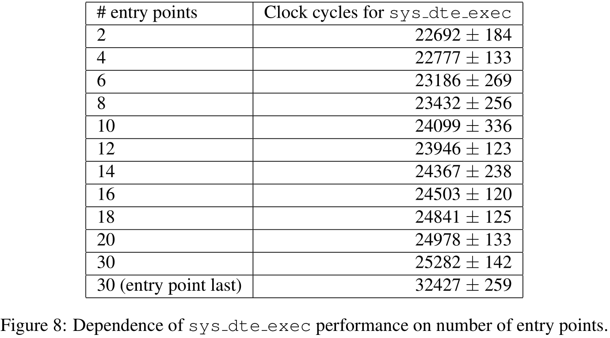

# 操作系统与虚拟化安全第三组第四次作业文档

## 题目

任务三：DTE 策略表示及在 Linux 中的实现

3.在了解 DTE 安全策略设计思想的基础之上，主要阅读以下文献：

Domain and Type Enforcement for Linux(DTE for Linux), 并完成以下任务，

主要：

1）分析 DTE 策略语言的表示技术。

2）分析 DTE 在 Linux 中实现的核心技术（文中实现，也可以参考分析目前 Linux 中的 TE 策略实现实现技术）。

3）分析 DTE 实现的可行性验证实验和结构分析情况，以及应用案例。

## DTE 策略语言的表示技术

知识模块 3-6 经典安全模型 DTE 中立安全模型

### DTE 概述

DTE (Domain and Type Enforcement) is an enhanced form of TE (Type enforcement).

TE / DTE 基于安全标签 (domain, type) 来限制进程进行访问。根据最小特权原则，通过恰当地配置来划分系统。

策略中立，可以表达多种安全目标。

### DTE 策略描述

DTE 将系统视为一个主动实体（主体）的集合和一个被动实体（客体）的集合。

- 每个主体有一个属性-域，每个客体有一个属性-型，这样所有的主体被划分到若干个域中，所有的客体被划分到若干个类型中。
- DTE 再建立 “域定义表” (Domain Definition Table) , 描述各个域对不同型客体的访问权限。
- 建立 “域交互表” (Domain Interaction Table), 描述各个域之间的许可访问模式（如创建、发信号、切换）。

### 实现思想

DTE 将进程分为域 (Domain)，文件分为类型 (Type)，并限制从域到类型以及从域到其他域的访问。

类型访问可以是读、写、执行、创建和递归遍历目录。域访问指发送信号的权力和转换到新域的能力。

一个进程在某个时刻只属于一个域。一个进程通过执行域入口文件转换到新域。域转换的三种类型是自动（auto）、执行（exec）、无（none）。

如果域 A 可以自动访问域 B，域 A 中的进程执行域 B 的入口文件，进程会自动转换到域 B。

如果域 A 可以执行访问域 B，域 A 中的进程执行域 B 的某个入口文件时可以选择是否转换到域 B 。

> 以前一个进程本身带有一组访问特定对象的权限，需要事先定义。而在 DTE 中，一个进程运行时只携带其所在域的指示符，这决定了该进程的权限。一个进程通过执行文件进入新域改变访问权限。

## 实现

在传统 UNIX 访问控制基础上，固定类型信息到虚拟文件系统索引节点（VFS inodes），域信息到进程描述符（process descriptors, task structs）。

### 数据管理

启动从文本文件`/etc/de.conf` 读取 DTE 策略。根据 DTE 策略文件内容为每个域构建一个结构体，该结构体包含了域访问、域转换、信号发送许可和入口的信息。每一个进程结构体都会包含一个指针，指向该进程所属域对应的结构体。

同时会创建一个包含所有类型名的数组，每个索引节点包含三个指针，要么为空要么指向该数组元素，三个指针分别代表 `etype`, `rtype`, `utype` 值，对应该文件或目录的类型、该目录和子文件/子目录的类型、子文件/子目录的类型。

一个具体文件的类型通过三种方式决定：

如果之前确定过类型，则索引节点的 `etype` 值会被设置，直接使用该值。

如果是第一次查找该文件，并且 DTE 策略文件里存在为其赋值类型的规则，则使用该规则。

如果规则也不存在，继承其父目录的 `utype` 值来设置 `etype` 值。

> 文件系统根的类型是在DTE策略中显式设置的。

由此可见索引节点 `utype` 值也必须存在，它按优先顺序被设置为已分配的 `utype`、已分配的 `rtype` 或父目录的 `utype`。

只有当有规则将 `rtype` 赋值给索引节点的路径时，才会设置索引节点的 `rtype`。

类型信息要么来自 DTE 策略文件要么继承文件系统树上的索引节点祖先。启动时根据 DTE 策略文件中的类型赋值规则在内存中构造映射节点树。映射节点用于确定将路径绑定到类型的规则是否存在，一旦设置了索引节点的类型，后续查找不会再次检查映射节点。

> 一组特定规则的示例树，以及相应索引节点中的类型信息

### 类型访问实施

当进程执行系统调用时，修改后的内核在检查标准 UNIX 权限之前先检查 DTE 权限。

使用进程描述符所指向的域结构体检查当前域是否具有对正在打开文件所属类型的访问权限，如果有就继续执行正常的 UNIX 检查。

对 DTE 执行权限的检查被延迟到实际调用 `execve` 时。如果执行导致允许的域转换，则此转换应在执行检查之前发生，因为新域可能是唯一允许执行入口点的域。

域到类型的访问信息被保存在一组散列表中。每个域结构体都有一个以类型名为键的散列表，每个条目列出了域对特定类型的访问权限。类型访问检查计算类型名的哈希值，为当前域寻找合适的域到类型访问入口。并比较请求的访问和允许的访问。

> 无论用户名是什么都执行此操作，因此超级用户也不会免于 DTE 策略。

### 域访问实施

本文的实现对属于不同域的进程之间的信号进行了限制。每个域结构体都包含一个 `dte_signal_access` 结构体组成的链表。结构体包含信号序号和指向接受该信号域的指针， 为方便起见，将后者设置为 null 表示向所有域发送指定信号，将前者设置为 0 表示向指定域发送指定的信号。

### 域转换实施

每次执行文件时可能有三种类型的域转换。

第一种是自动或强制的域转换，每次进程调用 `execve` 执行程序时都要检查正在被执行的文件是否是要转换到的域的入口文件。

第二种是执行或用户请求的域转换后，这通过一个新的系统调用 `sys_dte_execve` 实现，该系统调用在 `execve` 上附加了一个包含请求的域的参数。

第三种也是默认的转换是 NULL 转换，不改变域。

域结构体会链接两种结构体，保存域转换信息。每个域结构都包含一个执行会导致自动域转换的路径名，以及要切换到的域的哈希表。

域结构体还有一个表示允许的执行转换的结构体链表，指向允许某个执行转换的域。要检查对某个域的执行访问，首先检查请求的域的执行入口文件，然后检查正在执行的文件是否为域入口文件。

### DTE 策略文件

DTE 策略文件 `/etc/dte.conf`  首先枚举类和域，然后指定文件系统根（"`/`"）及其子文件/子目录的默认类型，第一个运行进程（`init`）的所属域。

接下来是具体每个域的定义。指定每个域的进入点文件、允许的类型访问、允许的域转换和允许的向其他域中进程发送的信号。

最后列出类型赋值规则。

> 一个 DTE 策略文件的例子，具体说明见论文 3 Administration 节。

### DTE API

提供了三个系统调用以允许软件与 DTE 交互。`sys_dte_exec` 上面已做说明。用户可以调用 `sys_dte_gettype` 来了解与文件相关联的类型，可以调用 `sys_dte_getdomain` 来了解与进程关联的域。

## 可行性验证实验和结构分析

在 400 Mhz Pentium Ⅱ，512K L2 cache，384M ram 配置上进行测试，使用 Pentium 时钟周期计时。每个测试都在一个 DTE 编译的内核和一个使用 DTE 策略编译的内核上进行。  

> 测试用的 DTE 策略文件见 Figure 3

### 权限检查

任何文件操作之前都会调用 `fs/namei_c:permission` 内核函数检查用户是否被授权执行所请求的操作。检查域到类型的访问权限的代码位于该函数顶部，以便在标准 UNIX 权限之前检查 DTE 权限。

上面已经说过每个域都有一个哈希表，以类型名称为键，列出域对各个类型的访问权限。因此当类型数目一定时 DTE 权限检查非常快，为常数级。当然因为需要先找到路径名，然后对它进行哈希，时间对于路径名长度是线性的。

当在某个文件/目录上第一次调用该函数时需要根据存储 DTE 类型赋值规则信息的映射节点树自底向上设置各个节点的 `etype` 值，这可能会造成一定的性能影响。通常情况下查找路径对应的类型较快。

多次测试计算可得添加的 DTE 相关代码为每个 `permission` 调用增加了 1578±400 个时钟周期。

### 目录查找

查找给定路径名所需的时间极大地影响了系统的性能。在Linux内核中执行此任务的函数是  `fs/name.c:lookup dentry`在两处收到 DTE 的影响：

- 对每个路径名里的子目录，`lookup_dentry` 调用 `permission` 检查执行权限。
- 如果要查找的最深层路径元素还没有设置类型，要像上面提到的一样进行设置。

对一组路径名（深度依次从1到9）进行计时查找，分文件存在和不存在两种情况。第一次执行时没有路径名组件缓存，后续执行时所有的路径组件和对应的 DTE 类型信息被缓存。

对于查找未缓存文件名的情况，结果似乎难以预测。

对于缓存查找，DTE 内核的表现比普通内核的两倍还要好一些。

### 自动域转换

文件执行时必须检查请求执行是否会引起强制域转换。转换通过 `kernel/dte.c:dte_auto_switch` 函数完成。因为每次文件执行时都要被调用，该函数必须足够快，因此该函数只对可执行文件名进行散列，检查通道表中会导致自动域转换的可执行文件的条目。

文中编译了计时 `dte_auto_switch` 执行的内核。如果一个特定域没有通道，`dte_auto_switch` 不需要对类型名进行散列， 因此 `execve` 期间执行 `dte_auto_switch` 需要 308±6 个时钟周期。如果有就必须搜索哈希表，需要 6655±166 个时钟周期。

### 执行域转换

使用 DTE 的代码中效率最低的在 `kernal/dte.c:sys_dte_exec`。首先，用户提供要切换到的目标域的名字。由于域名没有被散列或按任何顺序保存，因此查找相应的域名结构是 $O(d\times , m)$，其中 $d$ 是已定义域名的数量，$m$ 是域名的最大长度。

接下来还要搜索另一个无序列表，其中包含当前域可能自动切换到的域，以检查域切换是否合法。

然后搜索第三个列表，其中包含目标域的有效入口点。

为了策略检查 `exec` 切换所需的时间，文中设置了 12 个域，对应入口点数目 2、4、6、8、10、12、14、16、18、20和30，其中两个域有30个入口点。然后进行执行域转换转换到这些域，并测量 `sys_dte_exec` 开始到其调用 `sys_execve` 之间的时间。

前 11 个域分别执行了各自域的入口点列表的第一个文件。性能差异来自允许执行转换的列表。

当域有8个以下的入口点时，`sys_dte_exec` 作为出现较少的系统调用，花费大概 `dte_auto_switch` 4 倍的时间。

### execve

为了对内核函数 `fs/exec.c:do_execve` 进行计时，对其进行包装，在实际调用前后加上时间戳，这样可以测量文件执行的全部时间。

执行 `/bin/echo -n` 命令 500 次，无论是否使用DTE，第一次运行的执行时间都比后续运行的执行时间大一个数量级，因为一些库文件以及可执行文件 `/bin/echo` 可能还没有从磁盘加载。

可见 DTE 代码会引入 10% 左右的开销。

### 内核编译

最后只使用 `/usr/bin/time` 来确定启用 DTE 前后内核编译性能的差异。

普通 2.3.28 内核耗时 5 分 55 秒第一次编译，后续 14 次 每次编译 5 分 35 ± 0.384387 秒。而启用 DTE 的内核第一次需要 5 分 56 秒，后续每次耗时 5 分 36  ± 0.205464 秒。

## 应用案例

文中使用利用缓冲区溢出的 *wu-ftpd* 漏洞进行测试。展示了 DTE 实现可以阻止攻击者获得 root shell。

连接到测试机器，发送 *wuftpd2600* 脚本。相比普通的 2.3.28 内核，启用 DTE 的内核拒绝 `ftpd_d` 域执行 `/bin/sh`，导致脚本被挂起，发送错误信息到 `syslong`，系统得到保护。

> Figure 10 对应阻止 *wu-ftpd* 的 DTE 策略文件内容。